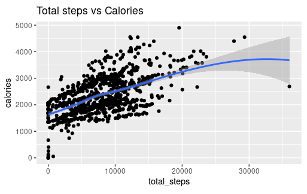
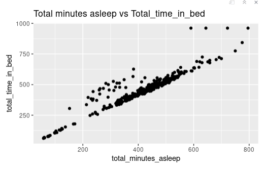
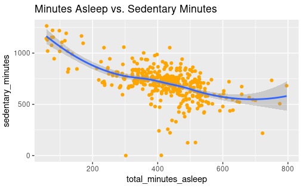

# Bellabeat-Google-data-analytics-capstone
Capstone project done during Google data analytics course by Coursera

## Table of content

- Client Introduction
- Meet stakeholders
- Understanding client requirements
- Business task
- Understanding data
- Preparing and Performing Analysis
- Sharing Analysis
- Actionable Findings
- Key takeaways
- References used
- Questions

## Client Introduction

Bellabeat, a high-tech manufacturer of health-focused products for women, Bellabeat is a successful small company, but they have the potential to become a larger player in the global market.

Services offered by bellabeat are:

- Bellabeat Application
- Leaf
- Time
- Spring
- Membership

## Stake holder

1. Urska Srsen
	- Cofounder and Chief creative Officer
2. Sando Mur
	- Mathematician and cofounder
	- Key member of Bellabeat executive team
3. Bellabeat marketing and analytics team

## Business Task

Understand and analyze overall smart devices usage of Bellabeat to gain insights how people and using it and what client can do to improve their services by identifying market trends which can help them build strong marketing strategy and opportunities of growth.

**Steps taken are**
- Understand data
- Prepare data for analysis
- Cleaning data
- Data Analysis
- Data Visualisation

**``Please refer to Attached PPT and Rmarkdown file for detailed steps``**

##Insights and Suggestions

- Above data shows average steps taken by individual is 7406, which is quite low, as per research average steps for a healthy adult shoud be 10000.

- Based on this we can suggest bellabeat to make strategy to motivate users for 10000 steps 

- Client can start showing reminder to complete 10000 steps

- Data shows on an average user covers a distance of 5 km which is good sign

- Client can opt in for special customized alerts based on users previous data, if user is walking for 5 km per day generally, app should notify them if it is not done on specific day.

- The data also shows sedentary minutes average as 1057.5, which is too much and which is not good if being active is the goal of user.
- In this case there are three scenarios:
	- When user is inactive due to working style (working on system) then it may capture that time as sedentary as movement is less.
	- When user is asleep for some time 
	- When user is travelling. 

As we have limited data for user and we do not have much details as when this sedentary time was captured we can not reach out to root cause of this, however bellabeat can start having notifications if idle time is more than an hour to encourage physical activity

- Sending notifications for idle time and allowing user to snooze it or to set it for customized time can be done.
- Our data shows average calories burned are 2134. According to the Dietary Guidelines for Americans 2020–2025, the average adult woman burns roughly 1,600 to 2,400 calories per day so our data matches with the expectations.
- Bellabeat can use sending notifications here too to motivate users to progress on a fitness path.

- Users are mostly active for 4 minutes only 
- Users are fairly active for 6 minutes only
- Mostly users are lightly active
- Average user sleeps for 7 hours 
- Average time in bed is also around 7.64 hours

Data has limitations as we don't know sleep category, there are some apps which shows subcategory in sleep as deep sleep, light sleep

Bellabeat can use such subcategory to provide more customized user experience.

Bellabeat can work on creating a function which allows user to schedule sleep routine

Bellabeat can also work on sending notifications when sleep routine is about to start, so that user can work on their sleeping patterns as well, because study shows that 8 hours of sleep is required for a healthy life

Data shows average weight of user is 62.5 KG

Average BMI of user is 25.19, this is not good as BMI > 24.9 is considered as obese
Bellabeat can work on suggesting low calorie diets or recipes which user can refer to reduce weight.

## Supporting charts for our analysis are as below:

## `**Powerpoint presentation, Rmarkdown are attached**`

### **Thank you for your time, please do share your feedback**
